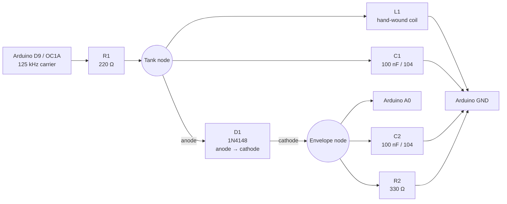

# Discrete EM4100 RFID Reader

A 125 kHz EM4100-compatible RFID reader built around an Arduino Uno, a
hand-wound coil, a diode envelope detector, and passive components. It does not
use a dedicated RFID reader IC or an external comparator.

The repository contains:

- A frequency sweep sketch for tuning an unknown coil without an LCR meter.
- A carrier-synchronous ADC reader for decoding 40-bit EM4100 identifiers.

## Hardware

- Arduino Uno or another 16 MHz ATmega328P board
- Hand-wound air-core coil
- 2 × 100 nF ceramic capacitors marked `104`
- 1 × 1N4148 diode
- 1 × 220 Ω resistor
- 1 × 330 Ω resistor

The tested coil was approximately 4 cm in diameter. Its turn count was adjusted
until the LC response was close to 125 kHz.

## Circuit



Exact net connections:

1. Arduino D9 connects through the 220 Ω resistor to the tank node.
2. The coil and the first 100 nF capacitor are connected in parallel between
   the tank node and GND.
3. The 1N4148 anode connects to the tank node.
4. The 1N4148 cathode connects to the envelope node.
5. Arduino A0, the second 100 nF capacitor, and the 330 Ω resistor connect to
   the envelope node.
6. The other ends of the second capacitor and 330 Ω resistor connect to GND.
7. All grounds are common.

> [!CAUTION]
> Keep A0 between 0 V and the Arduino supply voltage. A higher-Q driver can
> produce tank voltages substantially above the values seen in this prototype.

## Tune the coil

Open `coil_tuner/coil_tuner.ino`, select **Arduino Uno**, and upload it. Remove
all tags from the coil and open Serial Monitor at 115200 baud.

The sketch sweeps approximately 83–174 kHz and reports the detected envelope
voltage. The largest `A0_avg` value indicates the approximate LC resonance.
For 125 kHz, the target is:

```text
OCR1A=63 -> 125.0 kHz
```

If the peak is below 125 kHz, reduce inductance or capacitance. With a fixed
100 nF capacitor, carefully removing turns or spreading the winding raises the
resonant frequency. If the peak is above 125 kHz, add inductance or capacitance.

The sweep is an approximate tuning aid. The diode detector contains residual
carrier ripple, so nearby points may not form a perfectly smooth curve.

## Read a tag

Open `em4100_reader/em4100_reader.ino` and upload it. Open Serial Monitor at
115200 baud and place one tag flat against the coil.

The reader:

- Generates an exact 125 kHz carrier with Timer1.
- Samples A0 every 64 µs at a fixed carrier phase.
- Tries Manchester and biphase at RF/64 and RF/32.
- Searches every possible sample phase and both Manchester polarities.
- Checks the nine-bit header, ten row parity bits, four column parity bits, and
  stop bit.
- Locks onto the first parity-valid format.
- Requires the same identifier from three repeated frames before printing it.

Example output:

```text
ADC mean=... frames[M64,M32,B64,B32]=... lock=Manchester RF/64 missed=0 late=0
EM4100 ID: 0123456789  (Manchester RF/64)
```

Once the format is locked, `missed=0 late=0` indicates that sampling is keeping
up. The sketch disables the Timer0 overflow interrupt while sampling, so
`millis()`, `micros()`, and `delay()` must not be added to the active reader
loop.

## How the decoder avoids ADC aliasing

A normal `analogRead()` takes roughly 100 µs on an Arduino Uno. Residual
125 kHz carrier ripple can therefore alias into false software edges that look
like tag timing.

Timer2 starts each conversion exactly eight carrier periods after the previous
one. Every conversion consequently samples the same carrier phase. The decoder
then integrates each Manchester half-bit instead of relying on noisy individual
threshold crossings.

## Limitations

- Reading distance is short because the coil is driven directly through
  220 Ω from an Arduino pin.
- Coil geometry and component tolerances affect tuning.
- The decoder supports ASK Manchester and biphase RF/64 and RF/32. It does not
  decode PSK tags.
- EM4100 identifiers are broadcast without encryption. Use this project only
  with tags and systems you own or are authorized to test.

## License

MIT
