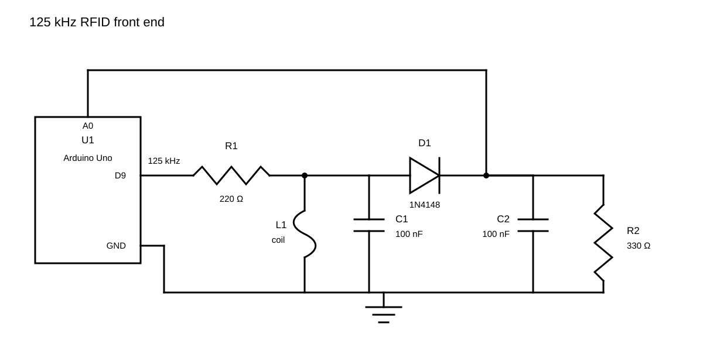

# Discrete 125 kHz EM4100 Reader / Writer

An experimental Arduino Uno project for reading standard 64-bit EM4100
transmissions and writing compatible T5577/T5557 tags with a hand-wound coil
and passive envelope detector. The tested hardware works only at short range
and uses no dedicated RFID reader IC, comparator, or external coil driver.

## Project structure

- [`coil_tuner/`](coil_tuner/) — sweep the LC tank and locate resonance.
- [`em4100_reader/`](em4100_reader/) — decode parity-valid EM4100 frames.
- [`t5577_writer/`](t5577_writer/) — prepare, write, and verify standard
  EM4100 data on compatible rewritable tags.

Each sketch folder has its own setup and usage guide. All sketches use
115200 baud.

## Parts

- Arduino Uno or compatible 16 MHz ATmega328P board
- Hand-wound air-core coil, approximately 4 cm diameter
- 2 × 100 nF ceramic capacitors (`104`)
- 1 × 1N4148 diode
- 1 × 220 Ω resistor
- 1 × 330 Ω resistor
- Breadboard, jumper wires, USB cable, and Arduino IDE

## Circuit



1. Connect D9 through 220 Ω to the tank node.
2. Connect the coil and C1 in parallel from the tank node to GND.
3. Connect the 1N4148 anode to the tank; its cathode is the envelope node.
4. Connect A0, C2, and 330 Ω to the envelope node.
5. Connect the other ends of C2 and 330 Ω to common GND.

Before connecting A0, use a meter and preferably an oscilloscope to verify that
the envelope remains between 0 V and the Arduino supply voltage. Directly
driving the tank from D9 is experimental and limits range and programming
energy.

Regenerate the diagram with:

```powershell
python generate_circuit_diagram.py
```

## Quick start

1. Upload [`coil_tuner.ino`](coil_tuner/coil_tuner.ino) and tune near 125 kHz.
2. Upload [`em4100_reader.ino`](em4100_reader/em4100_reader.ino) and confirm
   reliable short-range reads.
3. Upload [`t5577_writer.ino`](t5577_writer/t5577_writer.ino) only for a known
   compatible rewritable tag.

## Safety and limitations

- Use only tags and systems you own or are authorized to test.
- Factory-programmed EM4100/EM4102 tags are read-only.
- Writing is destructive; power loss or tag movement can leave a tag
  unreadable. Keep one tag centered until verification or recovery finishes.
- Keep every other tag away from the coil during writing and verification.
- Recovery is best-effort and cannot guarantee repair after an interrupted or
  weak-field write. Resetting or powering off the Arduino loses recovery data.

## License

[MIT](LICENSE)
